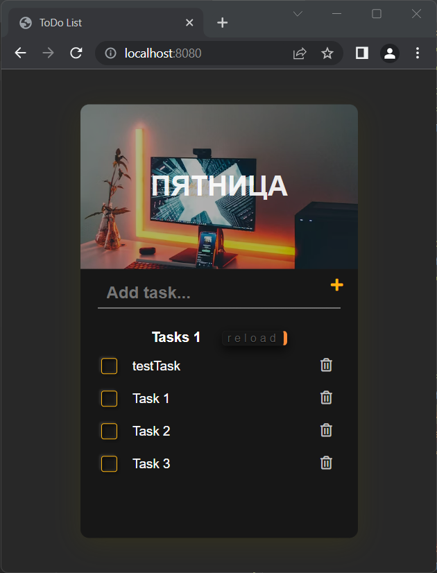

# TODO list

#### This is a variant of realisation of the TODO tasklist application.
#### In the backend part   created API with CRUD operations for adding, deleting   and displaying the todo list assigned for the current day.
#### There were used Java, Spring Boot, Redis, thymeleaf.

##### The frontend part   is a page with the ability to add and delete tasks,   and also display a todo list for the current day, saved in the database,  by clicking the "reload" button.
##### There were used HTML, CSS, Javascript, thymeleaf.

